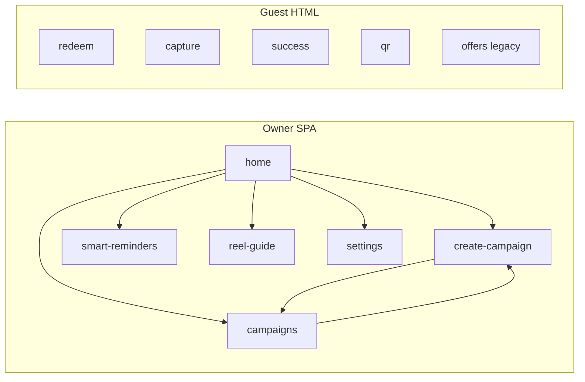

# Growth OS — UX specification

**Audience:** Design, product, and engineering.  
**Scope:** Owner-facing Growth OS SPA, Smart Actions hub, campaign builder, reminders, profile/menu, and guest-facing public pages.  
**Maintained with:** Flow-scoped context packs under [`.cursor/context/`](../.cursor/context/README.md) (keep this doc aligned when IA or principles change).

### Implementation status (owner flow continuity)

| Area | In code today |
|------|----------------|
| **IA** | `dashboard.html` top nav + legacy sidebar include **Reminders** → `?page=smart-reminders`. |
| **Home → reminders** | `ui-data-adapter.js` adds **Guest reminders** quick action; `handleAction` routes to the same flow. |
| **Trust copy** | `buildGrowthHomePayload` supplies `kpiFootnote` and `weekly.chartCaption`; React home shows them via `BentoKpiRibbon` + `WeeklyPerformanceCard`. Weekly chip no longer claims a fake “+18% vs last week”. |
| **Reminders exit** | After send: counts, skipped line, SMTP vs preview note, **Back to Home** + **Manage campaigns**. Entering reminders from another route runs `resetSmartRemindersFlow()` inside `navigate()` so a prior run does not stick. |
| **Campaign builder (UX-06–08)** | Preset hint on steps 1–2 when coming from quick actions; **Back** from launch step clears publish error state; **generation** and **photo regen** wrapped in try/catch with return to step 2 or 4 + message; **Publish live** vs **Save as draft** labels + hint; success screens differ (**View Live** vs **View drafts**) via `savedAsDraft`. |

---

## 1. User types

| User | Goal | Surfaces |
|------|------|----------|
| **Owner / operator** | Run promos, nudge guests, fix menu/profile data | Growth OS SPA (`?page=…`), dashboard / growth-home |
| **Guest** | Redeem offer, minimal friction | `redeem`, `capture`, `success`, `qr`, legacy offers HTML |

Design language can differ: **dense but calm** for owners; **large type, few fields** for guests.

---

## 2. Principles

1. **One primary job per screen** — Each route answers one question (what to do next vs build vs remind vs configure).
2. **Trust over hype** — Smart Actions and KPIs use **real signals** only; sampled or estimated metrics get an explicit **insight / sample** label—never fake precision.
3. **Profile before polish** — Campaign quality follows **menu + profile** completeness; prompt completion of menu (import, wizard, photos/stars) without blocking the whole app.
4. **Clear handoffs** — Dashboard CTAs pass **intent + metadata** into campaign builder (presets); reminders and offers stay **verbally and structurally** distinct.
5. **Guest surfaces stay minimal** — No Growth OS chrome; fast load, obvious next step.
6. **Recoverable failures** — Generation errors allow **regenerate** or **manual edit** without wiping wizard state; shell-level errors offer **retry**.

---

## 3. Information architecture

**Entry:** `/` → SPA; routes via `?page=<route>`.

**Recommended nav grouping (sidebar / labels):**

- **Grow:** Home, Create campaign, Campaigns  
- **Engage:** Smart reminders  
- **Create:** Reel guide  
- **Business:** Settings (profile, menu)

Adjust labels to match brand voice; keep **Reminders** and **Offers management** conceptually separate in copy.

---

## 4. Global patterns

| Pattern | Owner UX |
|---------|----------|
| **Navigation** | Persistent sidebar + contextual back in wizard; deep links from cards (`targetRoute`, `intent`, `metadata`). |
| **Loading** | Route skeleton or shell spinner; generation step shows **determinate or honest indeterminate** progress. |
| **Empty states** | No campaigns → primary CTA create; no eligible reminders → explain **eligibility**; thin menu → CTA import / quick setup. |
| **Errors** | Inline for fields; toast or banner for API; **Retry** at shell or step level. |
| **Trust labels** | Chip or footnote: “Based on last 7 days,” “Sample,” “Estimated,” as appropriate. |

**Production note:** Campaign QR / redeem links must use a **configurable public base URL** (not localhost) in real environments—QA and in-app copy should reflect the real domain.

---

## 5. Surface specifications

### 5.1 Home / Growth hub

**Purpose:** Orientation, priority actions, snapshot of performance and live campaign.

**Blocks (aligns with `frontend/growth-home` and hub data):**

- **Welcome hero** — Business name, tagline, human greeting.  
- **Menu signal** (conditional) — Item count; CTAs: Update menu, Quick setup (wizard).  
- **KPI ribbon** — Few metrics max; each: label, value, hint, optional bar; no fabricated numbers.  
- **Business hero** — Location, status chip, storefront image; bridge to settings / profile as needed.  
- **Weekly performance** — Trend label + small multi-day chart; highlight “today” or peak day.  
- **Spotlight campaign** — One live or priority campaign; insight string tied to real data; CTAs e.g. boost weekend, improve campaign (pass `sourceCampaignId` / presets).  
- **Action required** — Smart Actions–style cards: title, **reason (signal)**, single primary CTA.  
- **Quick actions** — Short list of verbs (create, reminders, menu, etc.).  
- **Schedule mini** — Upcoming posts or slots if data exists; otherwise hide or empty state.

**Analytics (see README Phase 4):** smart action impressions/clicks; funnel events for campaign flow where implemented.

### 5.2 Smart Actions (hub + reminders route)

**Card pattern:** Title + reason + one CTA. Optional **insightSample** chip when data is partial.

**Reminders route:** List **eligible** guests with clear criteria; batch send with **confirmation** and result summary (sent / skipped / failed). Language: **remind / nudge**, not “new offer” unless true.

### 5.3 Campaign builder (wizard)

**Steps (conceptual):** Intent → item picker → offer / tone → audience & goal → generation (spinner) → poster editor → preview → **Publish** vs **Save draft**.

**UX requirements:**

- Visible **progress** (step indicator); **Back** preserves state including Smart Action merges.  
- Post-generation: **Regenerate** scoped by target (copy vs poster) where API supports it.  
- Poster: preview at **approximate real sizes**; editing controls grouped logically.  
- Publish vs draft: **explicit labels**; after publish, clear success and path to campaigns / home.

**Profile-driven defaults:** cuisine, brand tone, audience, goal, menu items—surface when defaults are missing (“Using generic tone—set in Settings”).

### 5.4 Campaigns list

States: draft / live / paused (match backend vocabulary). Actions: open, duplicate, pause/relaunch as applicable. Empty state → create campaign.

### 5.5 Reel guide

Focused **single job**—do not duplicate full campaign step UI here. Link out to create flow when user picks “use in campaign.”

### 5.6 Settings (profile + menu)

**Sections:** Restaurant identity, cuisine, tone, audience, goals; menu import vs wizard; hours if collected.

Changing defaults: prefer clear copy whether changes affect **only new campaigns** or **existing drafts** (product decision—document here when chosen).

### 5.7 Public / guest pages

| Page | UX focus |
|------|----------|
| **Redeem** | Offer summary, brand trust, minimal inputs, clear success/failure. |
| **Capture** | Short form; explicit consent if collecting data. |
| **Success** | Confirmation + optional next step (visit, follow). |
| **QR** | Large tap targets, no SPA dependency. |
| **Legacy offers** | Consistent offer semantics with SPA where possible. |

---

## 6. Figma (or design tool) file structure

Use as **pages** and **top-level frames**; duplicate for dark mode if needed.

**Page: 00 — Foundations**

- Color / type / spacing tokens (map to Tailwind theme: sage, clay, bento radii, etc.)
- Components: buttons, chips, cards, stepper, sidebar item, empty state, error banner

**Page: 01 — IA & flows**

- User flow: Home → Create → Publish → Home  
- User flow: Home → Reminders → Batch send → Confirmation  
- User flow: Settings → Menu wizard → Home (menu signal resolved)

**Page: 02 — Home / dashboard**

- Frame: `Home — default`  
- Frame: `Home — menu signal`  
- Frame: `Home — empty (no campaigns)`  
- Frame: `Home — mobile` (stack bento)

**Page: 03 — Campaign builder**

- Frames: one per step + `Generating` + `Poster edit` + `Preview`  
- Frame: `Error — regenerate`

**Page: 04 — Reminders**

- Frame: `Eligible list`  
- Frame: `Batch confirm`  
- Frame: `Result summary`

**Page: 05 — Settings & menu**

- Frame: `Settings overview`  
- Frame: `Menu import`  
- Frame: `Menu wizard — step N`

**Page: 06 — Public**

- Frame: `Redeem`  
- Frame: `Success`  
- Frame: `QR landing`

---

## 7. Backlog (alignment tickets)

Use for GitHub/Jira; IDs are arbitrary.

| ID | Title | Acceptance (summary) |
|----|--------|----------------------|
| UX-01 | Home empty state | Primary CTA to create campaign; secondary to settings/menu if profile thin. |
| UX-02 | Menu signal banner | Shown when item count below threshold; both CTAs wired in bridge. |
| UX-03 | KPI trust labels | Every KPI has hint or chip; no placeholder metrics in production. |
| UX-04 | Spotlight campaign | One hero campaign; insight string from real signal; boost/improve presets passed to builder. |
| UX-05 | Smart Action cards | Title, reason, one CTA; sample chip when applicable; impression/click hooks. |
| UX-06 | Wizard progress + back | Step indicator; back does not drop Smart Action preset. |
| UX-07 | Generation recovery | On failure: regenerate + manual edit; no full reset. |
| UX-08 | Publish vs draft | Two explicit actions; post-publish confirmation screen or toast + deep link. |
| UX-09 | Reminders batch UX | Confirm modal; result summary with counts. |
| UX-10 | Reminders vs offers copy | No cross-terminology in primary CTAs. |
| UX-11 | Settings defaults copy | Clarify impact on new vs existing campaigns when profile changes. |
| UX-12 | Public redeem | Mobile-first; error states readable; matches QR destination branding. |
| UX-13 | Public base URL | Staging/prod QR and links use env-based base; documented for QA. |

---

## 8. Analytics mapping (reference)

Align UI hooks with product analytics (see root `README.md` Phase 4), including:

- `setup_started`, `intent_selected`, `menu_item_selected`, `offer_type_selected`  
- `custom_rule_added`, `ai_orchestrator_requested`, `ai_option_selected`  
- `campaign_published`, `channel_asset_published`  

Add **Smart Actions** events where implemented: impression, click, optional `action_id` / metadata for learning.

---

## 9. Open questions

1. **Default scope when profile changes** — New campaigns only vs also refresh drafts?  
2. **Growth-home vs legacy home** — Single source of truth for home layout until migration completes; avoid divergent KPI definitions.  
3. **Orchestrator panel** — When Phase 2 suggestion API is primary UI, insert **guided decision** step or side panel without adding a second “wizard inside the wizard.”

---

*Version: 1.0 — aligned with repo context packs and `frontend/growth-home` structure.*
